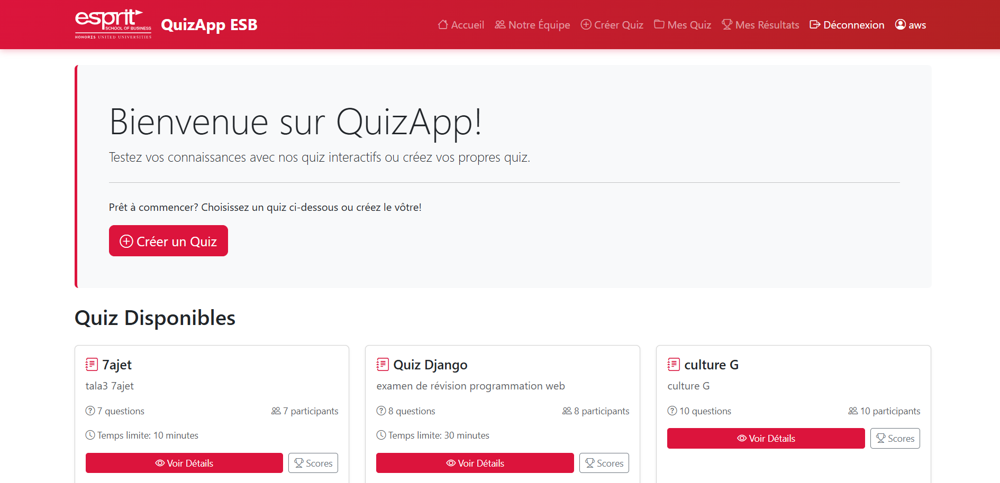

# 🎓 QuizApp ESB - Application de Quiz en Ligne


Application web interactive développée par les étudiants de l'**École Supérieure de Business (ESB)** permettant de créer des quiz, définir des questions, et suivre les résultats en temps réel.

## 📸 Aperçu



## ✨ Fonctionnalités

### Pour les Créateurs
- ✅ Créer des quiz personnalisés avec titre et description
- ✅ Ajouter des questions (choix unique, multiple, vrai/faux)
- ✅ Définir des points par question
- ✅ Activer/désactiver les quiz
- ✅ Voir les statistiques de participation

### Pour les Participants
- ✅ Parcourir les quiz disponibles
- ✅ Passer des quiz interactifs
- ✅ Correction automatique instantanée
- ✅ Historique des tentatives
- ✅ Classement avec médailles (🥇🥈🥉)

### Fonctionnalités Générales
- ✅ Authentification sécurisée (inscription/connexion)
- ✅ Design responsive (mobile, tablette, desktop)
- ✅ Interface moderne rouge/blanc ESB
- ✅ Messages de feedback en temps réel
- ✅ Page dédiée à l'équipe de développement

## 🛠️ Technologies Utilisées

- **Backend:** Django 5.2.9, Python 3.11
- **Frontend:** HTML5, CSS3, Bootstrap 5.3, JavaScript
- **Base de données:** SQLite3
- **Icônes:** Bootstrap Icons
- **Architecture:** MVC (Model-View-Controller)

## 📥 Installation

### Prérequis
- Python 3.8 ou supérieur
- pip

### Étapes

1. **Cloner le repository**
```bash
git clone https://github.com/VOTRE_USERNAME/quiz-esb.git
cd quiz-esb
```

2. **Créer un environnement virtuel**
```bash
python -m venv venv

# Windows
venv\Scripts\activate

# Mac/Linux
source venv/bin/activate
```

3. **Installer les dépendances**
```bash
pip install -r requirements.txt
```

4. **Effectuer les migrations**
```bash
python manage.py migrate
```

5. **Créer un superutilisateur**
```bash
python manage.py createsuperuser
```

6. **Lancer le serveur**
```bash
python manage.py runserver
```

7. **Accéder à l'application**
- Application : http://127.0.0.1:8000/
- Admin : http://127.0.0.1:8000/admin/

## 📱 Utilisation

### Créer un Quiz
1. Connectez-vous
2. Cliquez sur "Créer Quiz"
3. Remplissez le titre, description, temps limite
4. Ajoutez vos questions avec les choix
5. Activez le quiz

### Passer un Quiz
1. Parcourez les quiz disponibles
2. Cliquez sur "Commencer le Quiz"
3. Répondez aux questions
4. Consultez vos résultats

## 👥 Équipe de Développement

### Aws Ourari
**Lead Developer & Backend**
- Développement backend Django
- Architecture de la base de données
- Logique métier et correction automatique

### Najla Nairi
**Frontend Developer & UX Designer**
- Design de l'interface utilisateur
- Intégration Bootstrap
- Expérience utilisateur responsive

### Ines Jaziri
**Full Stack Developer & Tester**
- Développement full-stack
- Tests et débogage
- Assurance qualité

## 🎓 Contexte Académique

- **Établissement :** École Supérieure de Business (ESB)
- **Année :** 2024-2025
- **Type :** Projet de développement web
- **Objectif :** Créer une plateforme éducative interactive

## 🚀 Fonctionnalités à venir

- [ ] Export des résultats en PDF
- [ ] Questions avec images
- [ ] Chronomètre en temps réel
- [ ] Badges et achievements
- [ ] Mode sombre
- [ ] API REST
- [ ] Application mobile

## 📊 Structure du Projet
quiz_application/
├── quiz/                  # Application principale
│   ├── models.py         # Modèles de données
│   ├── views.py          # Logique métier
│   ├── urls.py           # Routes
│   ├── forms.py          # Formulaires
│   └── admin.py          # Configuration admin
├── templates/            # Templates HTML
│   ├── quiz/            # Templates quiz
│   └── registration/    # Templates auth
├── static/              # Fichiers statiques
│   └── images/          # Images et logos
├── quiz_project/        # Configuration projet
│   ├── settings.py      # Paramètres Django
│   └── urls.py          # URLs principales
├── manage.py            # Script Django
├── requirements.txt     # Dépendances Python
└── README.md           # Documentation
## 🔒 Sécurité

- Protection CSRF sur tous les formulaires
- Authentification Django intégrée
- Permissions basées sur les utilisateurs
- Validation des données côté serveur
- Protection contre les injections SQL (ORM)

## 📝 Licence

Ce projet est développé à des fins éducatives dans le cadre de notre formation à l'ESB.

## 🤝 Contribution

Les contributions sont les bienvenues ! Pour contribuer :

1. Forkez le projet
2. Créez une branche (`git checkout -b feature/AmazingFeature`)
3. Committez vos changements (`git commit -m 'Add AmazingFeature'`)
4. Push vers la branche (`git push origin feature/AmazingFeature`)
5. Ouvrez une Pull Request

## 📞 Contact

awsourari123@gmail.com
---

<div align="center">

**Développé avec ❤️ par l'équipe QuizApp ESB**

[⬆ Retour en haut](#-quizapp-esb---application-de-quiz-en-ligne)

</div>
